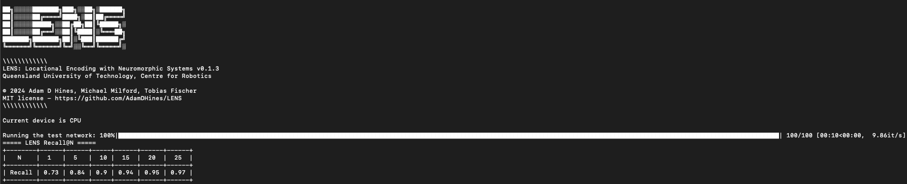
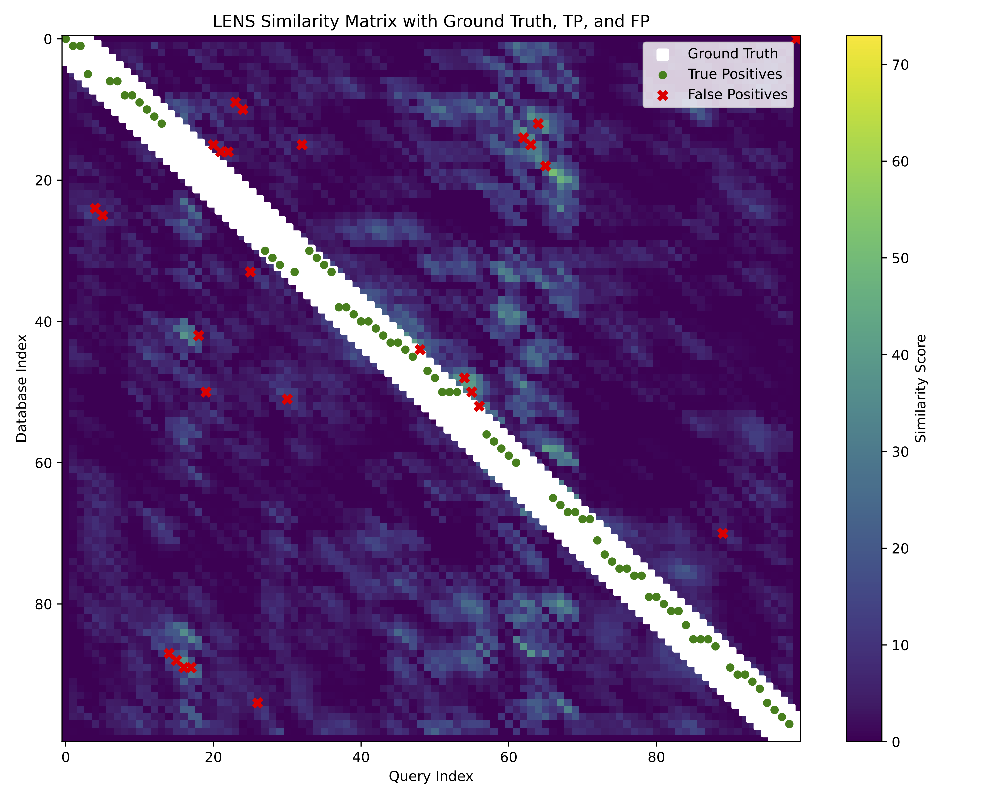
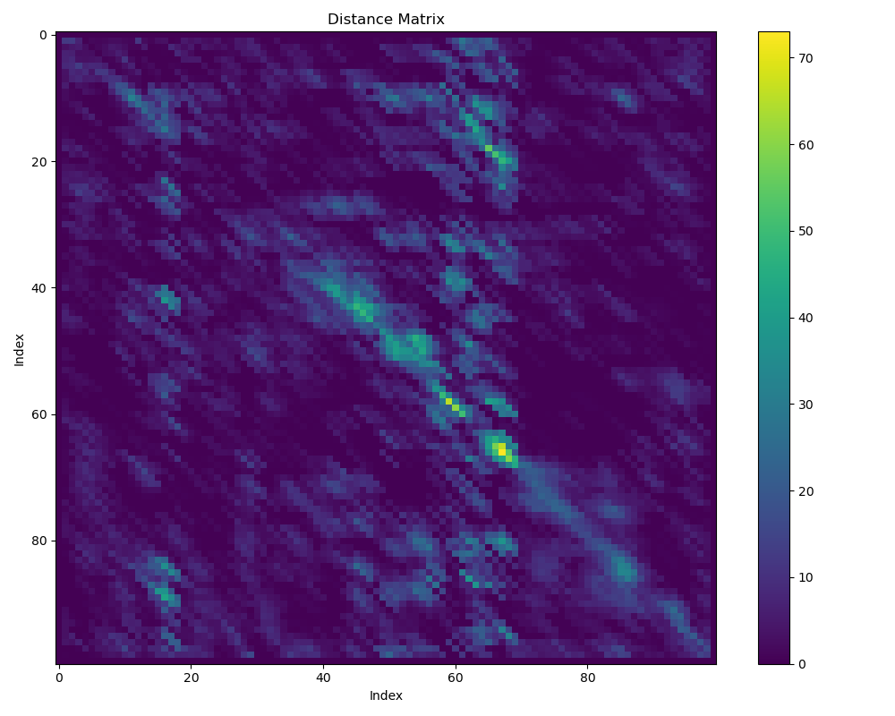

Evaluating Models
==================
In this guide, we will explore the evaluation network and the different parameters available and analysis.

.. note:: 

    This guide assumes you have already set up your dataset and have an appropriate ground truth file. See :doc:`Model Training <train_overview>`
    for more details.

Running the evaluation network
-----------------
To run the training network, we simply need to run the following in the command terminal:

.. code-block:: bash

    pixi run evaluate

This runs the default settings with the example dataset included in the project directory. However, if we wanted to see what this would like with a custom dataset we
can add the arguments in manually:

.. code-block:: bash

   pixi run evaluate --dataset example --camera davis128 --reference example-reference --reference_places 100 --query example-query --query_places 100

Similar to the training, we define the ``--dataset`` and ``--camera`` we want to use, but we also still need to pass in the ``--reference`` 
and ``--reference_places`` information so that LENS knows which model to import.

Additionally, any specifications made to ``--dims``, ``--roi_dim``, and ``--feature_multiplier`` must be included to ensure the evaluation
runs.

.. hint::

    If training and evaluating on your own dataset, you can change the defaults in ``main.py`` to simplify command terminal execution.

A Recall@K caluclation will run to quantify how well your network performed based on the ground truth file provided.

This tells us we achieved a Recall@1 of 0.73, meaning when only allowing each query to match to a single reference we achieve 73% accuracy.

Ground truth tolerances
-----------------
Our ground truth binary matrix assumes that every single query has a singular matching reference. This can be somewhat overly strict in terms of 
localization in real world scenarios.

We include a method for allowing a tolerance in the ground truth that is based on a fixed number of places:

.. code-block:: bash

    pixi run evaluate --GT_tolerance 3

In the above, this will dilate the ground truth matrix to allow true positive matches to occur if the LENS network predicted a place that is 
+ or - 3 places from the actual ground truth.

.. hint::

    To enforce the strictest matching, set the ``--GT_tolerance`` to 0.

In our example dataset, if we set ``--GT_tolerance 0`` we drastically reduce Recall@1 performance from 0.73 to 0.12.

Sequence matching
-----------------
The length of the sequence matcher can be modified based on the distances between places in your images. Typically, but not always, a longer
sequence length will enhance Recall@K performance whereas shorter lengths diminish accuracy.

In the case of LENS, especially in terms of the pixel selection methodology, sequence matching is required to achieve sufficient accuracy.

To modify the sequence length, we use the ``--sequence_length`` argument which will adjust how many places to highlight sequential information for:

.. code-block:: bash

    pixi run evaluate --sequence_length 3

This will set the sequence length to be 3 places. If we compare Recall@1 performance when ``--sequence_length 0`` is used, we see a drop from 
0.73 to 0.55.

.. important::

    Sequence length is a user choosable parameter that ultimately depends on the downstream application. It would be advisable in any work
    to run an ablation study on the effects of sequence length on performance. Longer sequence lengths can sometimes reverse performance gains.

Results output & saving
-----------------
The results from running the LENS evaluation are automatically stored in the ``./lens/output/`` folder. The type of results that are stored depend
on the evaluations run.

Each time the LENS evaluation is run, a unique folder that is date and timestamped is generated to avoid overwriting information.

Standard outputs from LENS are a ``.log`` file consisting of the command terminal output, a ``.png`` image of the similarity and 
ground truth matrices, as well as a high quality ``.pdf`` of the similarity matrix showing the ground truth and corresponding matches.

Additional evaluations
-----------------
Additional evaluations are all stored in the same output folder described above.

Visualize similarity matrix
^^^^^^^^^^^^^^^^^
We can see the matrix of output spikes from LENS directly to observe visually how the model performed:

.. code-block:: bash

    pixi run evaluate --sim_mat

The colorbar represents the number of output spikes from the LENS model, higher spikes indicate highler similarity between query and reference,
and vice versa.

Precision-Recall curve
^^^^^^^^^^^^^^^^^
We can also output a Precision-Recall curve into a ``.json`` file by using the ``--pr_curve`` argument:

.. code-block:: bash

    pixi run evaluate --PR_curve

Sum of absolute differences
^^^^^^^^^^^^^^^^^
We can also compare to a baseline method built in to LENS, the sum-of-absolute-differences, to see how well it relatively performs:

.. code-block:: bash

    pixi run evaluate --sad