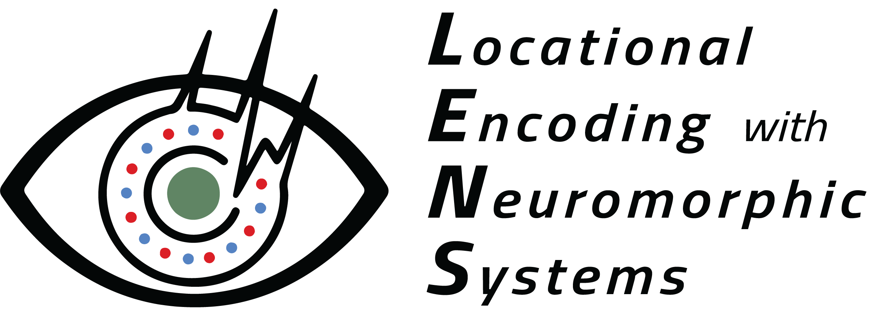

LENS documentation
==================

Welcome to the LENS (Locational Encoding with Neuromorphic Systems) documentation. LENS is an event-based, neuromorphic visual place recoginition system
to perform accurate and fast robotic localization. 

LENS was developed for the SynSense `SPECK™ <https://www.synsense.ai/products/speck-2/>`_, a combined neuromorphic processor and integrated dynamic vision sensor
for ultra energy-efficient and compact place recognition. However, LENS is fully compatible with conventional compute hardware for benchmark and custom event-based
localization datasets.

To get started, follow the steps below in `Getting Started` to install and run the demo for LENS.

.. toctree::
   :maxdepth: 2
   :caption: Getting Started:

   installation
   quickstart
   attributions

.. toctree::
   :maxdepth: 2
   :caption: Model training:

   train_overview
   train_params
   train_setup

.. toctree::
   :maxdepth: 2
   :caption: Evaluation:

   eval_overview
   eval_params
   eval_setup

.. toctree::
   :maxdepth: 2
   :caption: Network optimization:

   opt_overview
   opt_setup

.. toctree::
   :maxdepth: 2
   :caption: SPECK deployment:

   sp_overview
   sp_functions
   sp_dataset
   sp_setup
   sp_onchip