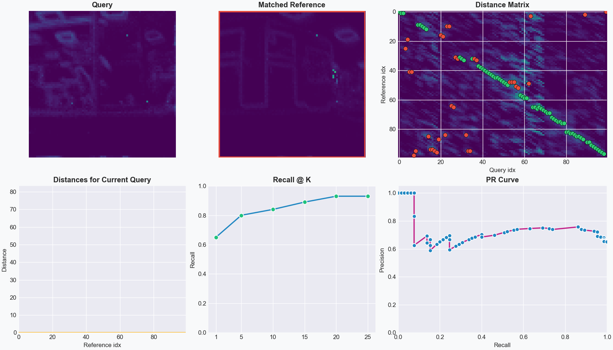
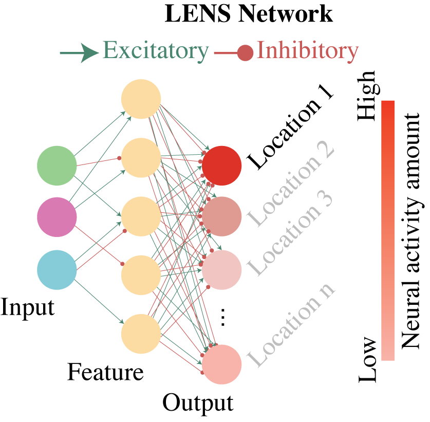

Quick start
=================
.. note::

    All instructions for the quick start guide will focus on the recommended install method of `pixi <https://prefix.dev/>`_. A list of commands will be provided
    at the end of this guide for conda and PyPi envrionments.

Demo
-----------------
After installing the dependencies and cloning the repository, we can run a demo of the evaluation system with the provided example dataset and model.
To run the demo evalluation, run the following in your command terminal:

.. code-block:: bash

    pixi run demo

This will run the evaluation network on a model that has learned 100 places from an indoor traverse on a Hexapod robotic platform. The data for which was collected 
from a SynSense Speck2fDevKit mounted to the front of the robot. 

An animation showing the query, its predicted reference match, and localization performance will appear when running the demo script.

The images of places are 2D-temporal representations of event streams collected over a 1-second time period. The 2D images are then converted into spike trains based 
on the pixel intensity.

The distance matrix that is the number of output spikes from the LENS network, where higher spike counts indicate greater similarity. 
We will explore this in more depth in later parts of the documentation. 

For the eavluation, we calculate the Recall@K and the Precision-Recall for each query image and its corresponding matches to the reference database based on a 
ground truth of the exact corresponding matches. 

.. note::

    We highly recommend this `tutorial on visual place recognition <https://ieeexplore.ieee.org/document/10261441>`_ which covers all evaluation metrics.

Evaluation network
-----------------
The evaluation network can run with greater control over the functionality of LENS, including specifying query/reference datasets, spiking timesteps for images,
and evaluation metrics. 

To use the evaluation network, run the following in your command terminal: 

.. code-block:: bash

    pixi run evaluate

This runs LENS with ground-truth matching and a Recall@K calculation, which requires a ground-truth binary matrix for stored as a ``numpy array``. We will explore 
generating ground-truth files later in the documentation.

We can change the number of spiking timesteps that will be generated for each image by using the ``--timebin`` flag. Fewer timesteps will result in less information
passed to the network for each image, but decrease inference time. We can change the timesteps to 250 from the default 1,000:

.. code-block:: bash

    pixi run evaluate --timebin 250

You will notice that the Recall@K decreased with the smaller timebin.

In LENS, we also provide an in-built baseline comparison to the sum-of-absolute-differences (SAD) method to compare relative performance of your models:

.. code-block:: bash

    pixi run evaluate --sad

.. note::

    For a full list of evaluation functions, please refer to the :doc:`Evaluation Parameters <eval_params>` page for more information.    

Training models
-----------------
New models can be easily trained and evaluated quickly. To train a new model and evaluate it, run the following in your command terminal:

.. code-block:: bash

    pixi run train
    pixi run evaluate

Our training method uses an efficient spike-timing dependent plasticity `(STDP)` regime to learn the weights across a 3-layer network (input, feature, and output). 

In this network, we have a network architecture of 100 input neurons, 200 feature neurons, and 100 output neurons where each output corresponds to a single place.

If we want to improve Recall@K performance, we can increase the number of feature neurons to better encode spatial information:

.. code-block:: bash

    pixi run train --feature_multiplier 4.0
    pixi run evaluate --feature_multiplier 4.0

We can also directly alter the number of query and reference images to train on, use different datasets, and modify all the network hyperparameters
for learning using this script. Run the following in your command terminal to evaluate fewer query images:

.. code-block:: bash

    pixi run train --reference_places 50
    pixi run evaluate --reference_places 50 --query_places 50

.. note::

    All training and evaluation functions are explored in the :doc:`Evaluation Parameters <eval_params>` and :doc:`Training Parameters <train_params>` pages.

Direct Python execution
-----------------
For non-pixi environments, below is a list of the above command-line executions to run the LENS demo, evaluation, and training scripts.

Run the demo:

.. code-block:: bash

    python main.py --demo --matching --PR_curve

Run the evaluation script:

.. code-block:: bash

    python main.py --matching

Run the training script:

.. code-block:: bash

    python main.py --train_model