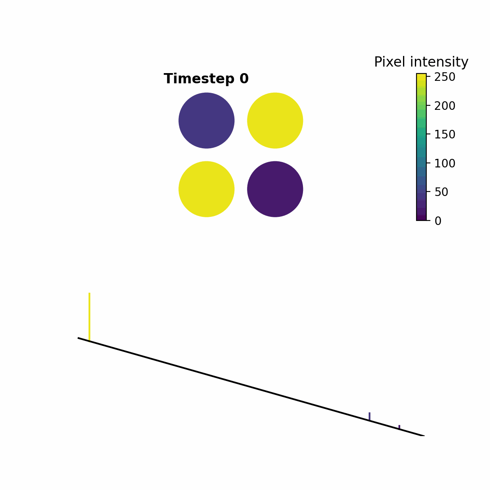
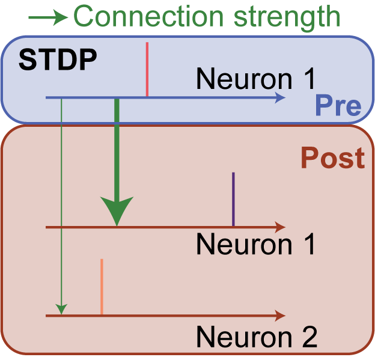

Overview
==================
In this part of the documentation, we provide a detailed description and visualization of the training regime used for LENS and explain the core logic
of the weight updates.

In addition, we will also explain how you can train on custom datasets as well as the process for creating images that can be used for training new models.

.. note::

    We highly recommend additionally exploring the :doc:`Optimizer <optimizer/overview.rst>` to tune the network hyperparameters for custom datasets.

Background
-----------------
The LENS neural network uses a unique temporal spike-encoding method first introduced for visual place recognition in `VPRTempo <https://github.com/QVPR/VPRTempo>`_. The
key abstraction in the temporal encoding is to treat spike timing as a function of pixel intensity, `i.e. spike amplitude`. This results in a high spike efficiency, reducing
the amount of information required to encode pixel information.

In the above, a simple 2x2 example shows how the different pixel intensities results in unique spike encoding for each combination of colors.

We can exploit this abstract encoding to be used with a spike-timing dependent plasticity (STDP) where the spike amplitude between layers is compared. If a spike
in a preceeding layer has a high amplitude and connects to neuron which results in a lower amplitude spike, we strengthen that connection by assuming `the preceeding
neuron spiked first, followed by the second neuron`.

The inverse is also true, if the preceeding neuron had a spike that was lower in amplitude than its connecting neuron, we weaken the connection.

We train the layer connection weights in pairs, from the input to the output - in the case of LENS, we initially train the input to the feature layer and then the
feature to the output layer. This means that each layer pair is trained using information from previously trained layers (excluding the input to feature pair). 

Connections
--------------

Connections across the layers consist of an excitatory and inhibitory weight, generating positive and negative spike values, respectively. The spike amplitude in a proceeding
layer neuron is determined by the summed value of all the excitatory and inhibitory connections. 

The amount of excitatory and inhibitory connections can be controlled via a connection probability, `i.e.` connections across layers can either be sparse or full. You can
also imbalance the amount of excitatory and inhibitory connections.

.. hint::

    Input to feature representations work best with sparse connections, whereas feature to output benefits from being fully connected.

Weight updates
--------------
The connection weights between neurons are updated using a biologically inspired STDP-like rule. The weight update equation is defined as:

.. math::

   \Delta W^{nm}_{ji}(t) = \frac{\eta_\text{STDP}(t)}{f^n_j} \cdot \Big[\Theta\big(x^m_i(t-1)\big)\cdot \Theta\big(x^n_j(t)\big)\cdot \big(0.5 - x^n_j(t)\big)\Big]

where :math:`W^{nm}_{ji}` is the connection weight from neuron :math:`j` in layer :math:`n` to neuron :math:`i` in layer :math:`m`, :math:`\eta_\text{STDP}` is the STDP 
learning rate, and :math:`f_j^n` is the target firing rate of neuron :math:`j` in layer :math:`n`. The Heaviside step function is denoted by :math:`\Theta(\cdot)`, 
and :math:`x^m_i` and :math:`x^n_j` are the neuron states in the corresponding layers and timesteps.

.. hint::

    The learning rule effectively calculates whether the amplitude of a spike was larger or smaller across layers, and makes a small increase or decrease in the weight,
    respectively.

.. note::

    Each of these hyperparameters are able to be modified for training.

